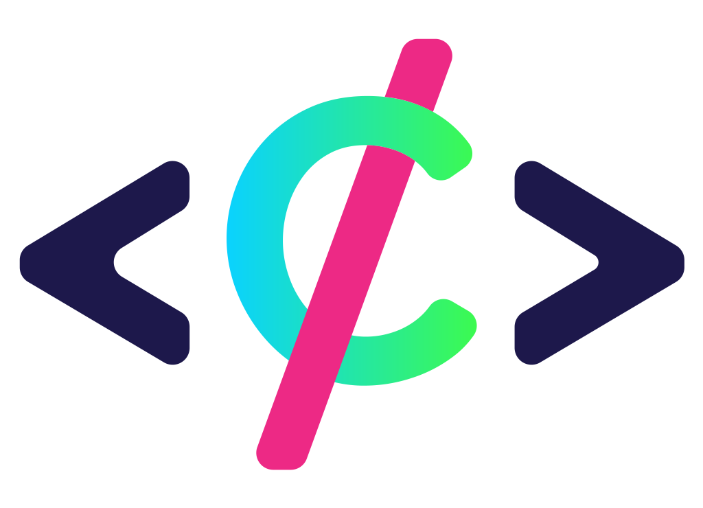

<h1 align="center">
  <br>
  <a href=""></a>
  <br>
  Project Canvas
  <br>
</h1>

<h4 align="center">A project management desktop app built with TypeScript, React, and Electron.</h4>

<p align="center">
  <a href="#key-features">Key Features</a> •
  <a href="#how-to-contribute">How To Contribute</a> •
  <a href="#download">Download</a> •
  <a href="#credits">Credits</a> •
  <a href="#license">License</a>
</p>


## Key Features

- Project View to inspect and choose the project.
- Backlog View to assign issues and edit sprints
- Sprints creation and deletion
- Create Issue Dialog to create all form of issues
- Story Map to plan next sprints and overall project
- Dark/Light mode
- Cross platform Windows, macOS and Linux ready.

## How To Contribute

### Installation

To clone and run this application, you'll need [Git](https://git-scm.com) and [Node.js](https://nodejs.org/en/download/) (which comes with [npm](http://npmjs.com)) installed on your computer. Preferrably use the [yarn](https://yarnpkg.com/) package manager.
From your command line:

Clone the repository:

```bash
git clone https://github.com/maibornwolff/project-canvas
```

Cd into the folder:

```bash
cd ProjectCanvas
```

Install dependencies:

```bash
yarn install
```

### Usage

To start project canvas:

```bash
yarn canvas
```

To add a new package (**this is important as this is a monorepo**):

> `project` can be `project-canvas` or `project-extender`

```bash
yarn workspace <project> add <package>
```

## Download

Download Project Canvas from the [Releases](https://github.com/maibornwolff/ProjectCanvas/releases) section and start using it! As simple as that.

> Note: please keep in mind that you need to have an account by the Provider you choose to use, for example Jira Cloud or Jira Server.

## Credits

This software uses the following open source packages:

- [React](https://react.dev/)
- [Electron](http://electron.atom.io/)
- [Mantine UI](https://mantine.dev/)
- [Fastify](https://www.fastify.io/)
- [Jest](https://jestjs.io/)
- [React Testing Library](https://testing-library.com/)
- [Playwright](https://playwright.dev/)

## License

BSD-3-Clause

---

> [maibornwolff.de](https://www.maibornwolff.com) &nbsp;&middot;&nbsp;
> GitHub [@maibornwolff](https://github.com/maibornwolff)
